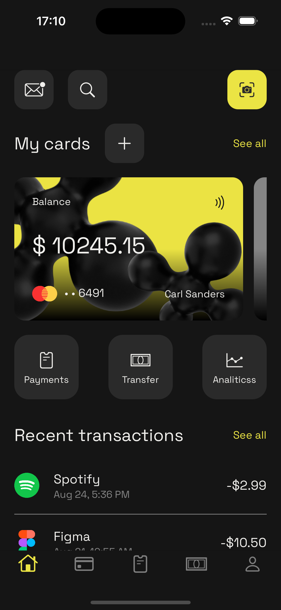
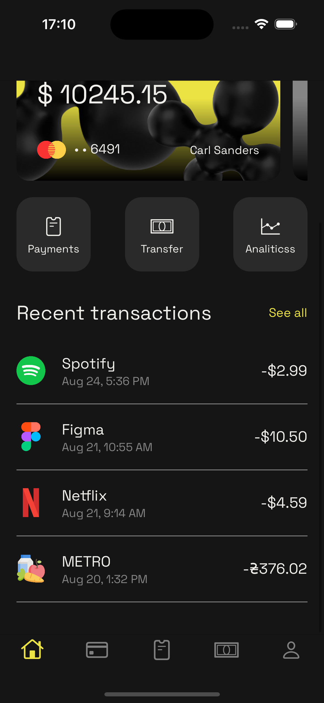
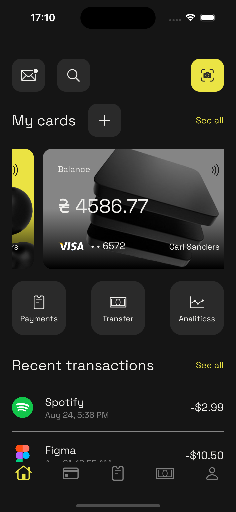
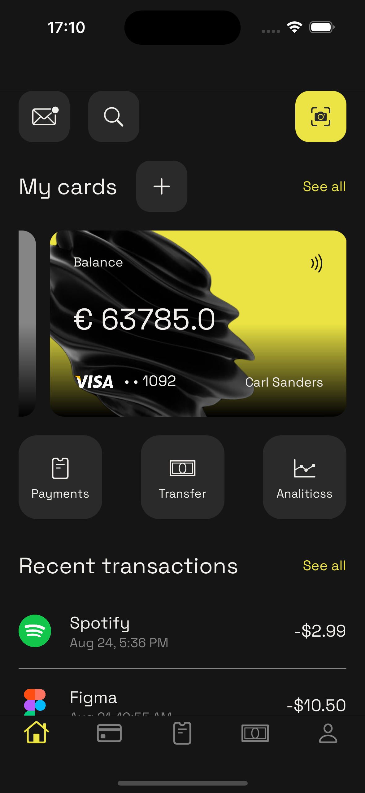
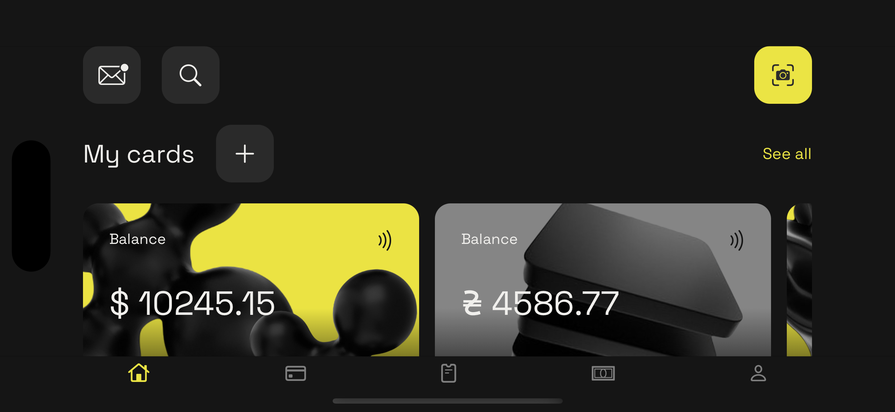
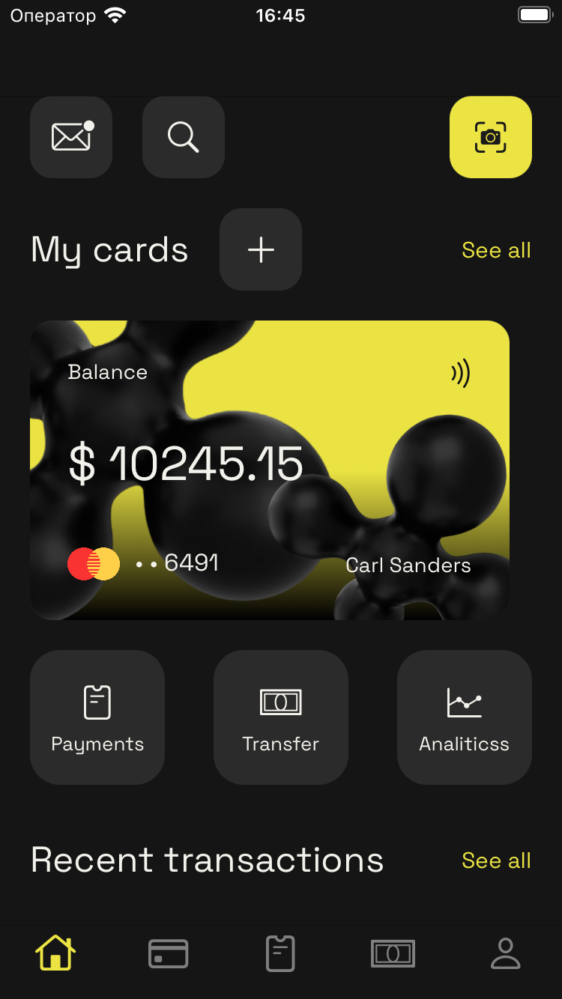

# IBank

This is UI only project for iBank project that has been inspired by RonasitIT Banking App Design Concept. 
The link <a href="https://www.behance.net/gallery/194352565/Banking-App-Design-Concept?tracking_source=search_projects|mobile+app&l=44">here.</a>
  

## About the project 
The project has been created by using Swift, SnapKit. It has Tab bar.
  

## Screens

### Home page iPhone 15 Pro

  

  

  

  

  

### Home page iPhone SE

  
